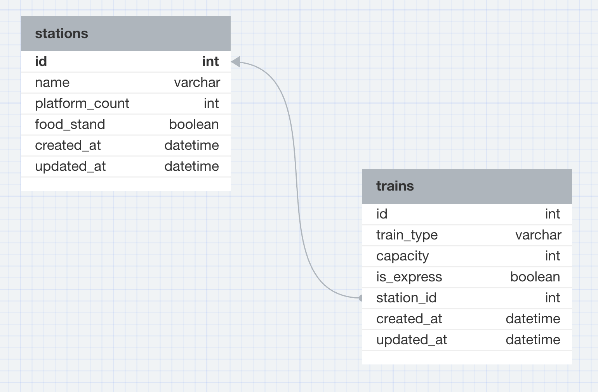

## README

### ALL ABOARD: Welcome to the relational_train_station!

##### (Please don't mind the mismatch between the web app name and the github repository name...)

* Ruby version  
7.0.8

* System dependencies  
See Gemfile for gems

* Configuration  
from terminal: $ bundle install

* Database  
PostgreSQL

* How to run the test suite  
from terminal: $ bundle exec rspec

* Deployment instructions  
from terminal: $ rails s  
from browser: http://localhost:3000

* Database Design Document 

I remember the day my cat walked across my keyboard and threw some extra letters in there, I had deleted everything except the semi-colon after station in the markup area!
